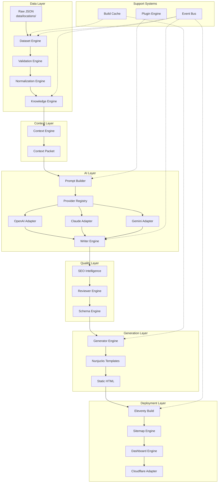
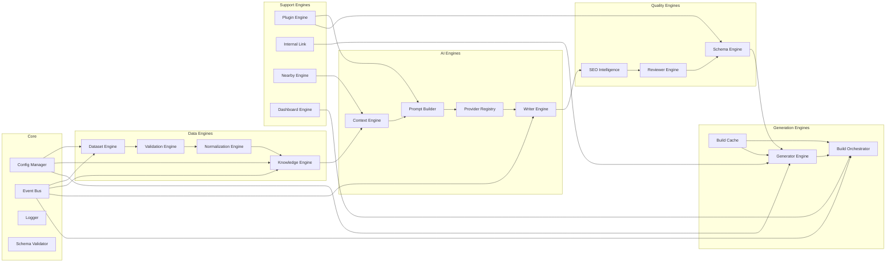

# Enterprise PSEO - Comprehensive Analysis Report

**Analysis Date:** July 2025  
**Repository:** enterprise-pseo  
**Version:** 0.2.0 (per CHANGELOG.md)  
**Analyst:** Lead Software Architect  

---

## Executive Summary

This repository implements an Enterprise Programmatic SEO (PSEO) Engine designed to generate localized, AI-powered content at scale. The system uses a multi-engine architecture with specialized components for data loading, knowledge graph construction, context compression, AI content generation, SEO optimization, quality review, and static site generation via Eleventy.

**Current State:** Core engine implementation is complete (Release 0.2.0), but significant gaps exist between documentation claims ("Production Ready") and actual implementation readiness. The repository contains substantial technical debt, documentation drift, duplicate code patterns, and missing critical infrastructure.

**Key Findings:**
- 35 JavaScript source files across engines, adapters, and core modules
- 22 documentation files with significant inconsistencies and outdated claims
- 12 unit test files (38 tests claimed passing)
- 104 data files (location JSON files for all 50 US states)
- Critical missing: environment configuration, CI/CD, security headers, sitemap generator integration

---

## 1. Complete Folder Structure

```
/workspace/
├── .ai/                              # AI agent context and memory system
│   ├── context/                      # Current session context
│   │   ├── ACTIVE_TASK.md           # Current task tracking
│   │   ├── ARCHITECTURE_ALIGNMENT.md # Architecture verification report
│   │   ├── CURRENT_SPRINT.md        # Sprint status
│   │   └── PROJECT_CONTEXT.md       # Project context summary
│   ├── memory/                       # Persistent AI knowledge
│   │   ├── ARCHITECTURE_MEMORY.md   # Architecture decisions
│   │   ├── BUSINESS_RULES.md        # Business logic rules
│   │   ├── DECISION_LOG.md          # Decision history
│   │   └── KNOWN_ISSUES.md          # Known issues log
│   └── prompts/                      # AI prompt templates
│       ├── bootstrap.md             # Bootstrap prompts
│       ├── deploy.md                # Deployment prompts
│       ├── implement.md             # Implementation prompts
│       ├── refactor.md              # Refactoring prompts
│       └── review.md                # Review prompts
│
├── config/                           # Configuration modules (4 files)
│   ├── app.config.js                # Application settings
│   ├── provider.config.js           # AI/deployment provider config
│   ├── seo.config.js                # SEO configuration
│   └── site.config.js               # Business/site metadata
│
├── data/                             # Source datasets (104 files)
│   ├── README.md                    # Data layer documentation
│   ├── derived/                     # Generated caches
│   │   ├── build-cache.json        # Incremental build cache
│   │   └── graph-cache.json        # Knowledge graph cache
│   ├── locations/usa/states/       # State-level location data (50 files)
│   │   ├── ak.json, al.json, ..., wy.json
│   │   └── il.json                 # Illinois (duplicate il1.json was removed)
│   └── services/                    # Service definitions
│       └── pest-control.json       # Primary service definition
│
├── docs/                             # Documentation (22 files)
│   ├── 00_DOCUMENT_INDEX.md        # Documentation navigation
│   ├── 00_PROJECT_CHARTER.md       # Project vision and goals
│   ├── 01_CONSOLIDATED_AI_PROTOCOL.md # AI operating rules
│   ├── 02_DATA_SPECIFICATION.md    # Data governance and contracts
│   ├── 04_ENGINE_ARCHITECTURE.md   # Engine architecture (4015 lines)
│   ├── 05_CODING_STANDARDS.md      # Development standards
│   ├── 06_API_SPECIFICATION.md     # API contracts
│   ├── 07_QUALITY_ASSURANCE.md     # QA gates and testing
│   ├── 08_AI_GOVERNANCE.md         # AI decision levels and approval
│   ├── 09_PRODUCT_REQUIREMENTS_DOCUMENT.md # Product requirements
│   ├── 10_IMPLEMENTATION_PLAYBOOK.md # Phased implementation plan
│   ├── 11_SECURITY_ARCHITECTURE.md # Security controls
│   ├── 12_OPERATIONS_RUNBOOK.md    # Operations procedures
│   ├── 16_DEVELOPER_HANDOFF.md     # Handoff template
│   ├── 17_PLUGIN_SDK.md            # Plugin system specification
│   ├── 18_PERFORMANCE_ARCHITECTURE.md # Performance concerns
│   ├── 19_ENTERPRISE_CHECKLIST.md  # Release checklist
│   ├── 22_REPOSITORY_RULES.md      # Repository conventions
│   ├── 23_DECISION_MATRIX.md       # Decision framework
│   ├── 25_PSEO_ENGINE_SPECIFICATION.md # PSEO-specific spec
│   ├── 99_DOCUMENTATION_AUDIT.md   # Documentation quality audit
│   └── JSON_SCHEMA.md              # JSON schema contracts
│
├── engine/                           # Legacy engine folder (unclear purpose)
│   ├── README.md
│   ├── data/                        # Legacy data layer
│   │   └── loader.js               # Dataset loader (modified per ARCHITECTURE_ALIGNMENT.md)
│   └── location/                    # Legacy location handling
│
├── generated/                        # Generated artifacts
│   └── reports/                     # Generated reports
│
├── output/                           # Build output directory (NOT YET CREATED)
│   └── pages/                       # Generated HTML pages (pending)
│
├── pest-control-seo/                 # Legacy/prototype folder (DUPLICATE - should be removed)
│   ├── README.md
│   ├── package.json
│   └── src/
│
├── reports/                          # Audit and validation reports (7 files)
│   ├── build-report.md             # Build execution report
│   ├── final-audit.md              # Final audit summary
│   ├── final-summary.md            # Project summary
│   ├── performance-report.md       # Performance metrics
│   ├── quality-report.md           # Quality assessment
│   ├── validation-report.json      # Detailed validation data (900KB)
│   └── validation-report.md        # Validation summary
│
├── scripts/                          # Utility scripts (4 files)
│   ├── README.md                   # Scripts documentation
│   ├── benchmark.js                # Performance benchmarking
│   ├── build-preview.js            # Build preview utility
│   ├── validate-data.js            # Data validation script
│   └── validate-and-fix-data.js    # Auto-fix validation script
│
├── src/                              # Main source code (35 JS files)
│   ├── README.md                   # Source documentation
│   ├── _includes/                  # Nunjucks partials (6 files)
│   │   ├── faqs.njk               # FAQ component
│   │   ├── hero.njk               # Hero section component
│   │   ├── localIntro.njk         # Local introduction component
│   │   ├── nearbyExclusion.njk    # Nearby cities exclusion
│   │   ├── serviceDetails.njk     # Service details component
│   │   └── widgets.njk            # Weather/maps widgets
│   ├── _layouts/                   # Layout templates (1 file)
│   │   └── main.njk               # Main page layout (7220 bytes)
│   ├── adapters/                   # External service adapters (9 files)
│   │   ├── ai/                    # AI provider adapters (6 files)
│   │   │   ├── ai-provider.js     # Base AI provider class
│   │   │   ├── claude-adapter.js  # Anthropic Claude adapter
│   │   │   ├── gemini-adapter.js  # Google Gemini adapter
│   │   │   ├── openai-adapter.js  # OpenAI GPT adapter
│   │   │   ├── provider-registry.js # Provider registration
│   │   │   └── queue-manager.js   # Rate limiting queue
│   │   ├── deployment/            # Deployment adapters (1 file)
│   │   │   └── cloudflare-adapter.js # Cloudflare Pages deployment
│   │   ├── maps/                  # Maps adapters (1 file)
│   │   │   └── maps-adapter.js    # Google Maps integration
│   │   └── weather/               # Weather adapters (1 file)
│   │       └── weather-adapter.js # OpenWeatherMap integration
│   ├── core/                       # Core utilities (7 files)
│   │   ├── cache.js               # Caching utilities
│   │   ├── config-manager.js      # Configuration management
│   │   ├── errors.js              # Error classes and handlers
│   │   ├── event-bus.js           # Event emitter system
│   │   ├── logger.js              # Logging utilities
│   │   ├── schema-validator.js    # JSON schema validation
│   │   └── utils.js               # General utilities
│   ├── engines/                    # Processing engines (19 files)
│   │   ├── build-cache.js         # Incremental build caching (117 lines)
│   │   ├── build-orchestrator.js  # Build coordination (314 lines)
│   │   ├── context-engine.js      # Context compression (125 lines)
│   │   ├── dashboard-engine.js    # Dashboard generation (329 lines)
│   │   ├── dataset-engine.js      # Dataset loading (276 lines)
│   │   ├── generator-engine.js    # Page generation (158 lines)
│   │   ├── internal-link-engine.js # Internal linking (38 lines)
│   │   ├── knowledge-engine.js    # Knowledge graph (266 lines)
│   │   ├── nearby-engine.js       # Nearby cities (49 lines)
│   │   ├── normalization-engine.js # Data normalization (60 lines)
│   │   ├── plugin-engine.js       # Plugin system (132 lines)
│   │   ├── prompt-builder.js      # AI prompt construction (75 lines)
│   │   ├── reviewer-engine.js     # Content review (141 lines)
│   │   ├── schema-engine.js       # Schema.org generation (148 lines)
│   │   ├── seo-engine.js          # SEO metadata (39 lines)
│   │   ├── seo-intelligence-engine.js # SEO analysis (152 lines)
│   │   ├── sitemap-engine.js      # Sitemap generation (NEW)
│   │   ├── validation-engine.js   # Data validation (117 lines)
│   │   └── writer-engine.js       # AI content writing (72 lines)
│   ├── index.njk                   # Homepage template
│   └── pages/                      # Generated page templates
│       ├── ak/                    # Alaska pages
│       ├── al/                    # Alabama pages
│       └── index.njk              # Pages index
│
├── Test/                             # Random test folder (should be removed)
│   └── hello.txt                   # Test file
│
├── tests/                            # Unit tests (12 files)
│   ├── README.md                   # Testing documentation
│   ├── fixtures/                   # Test data fixtures
│   └── unit/                       # Unit test files (12 files)
│       ├── ai-pipeline.test.js     # AI pipeline tests
│       ├── ai-seo.test.js          # AI+SEO integration tests
│       ├── build-cache.test.js     # Build cache tests
│       ├── config-schema.test.js   # Configuration schema tests
│       ├── dashboard-deploy.test.js # Dashboard/deployment tests
│       ├── dataset-layer.test.js   # Dataset layer tests
│       ├── foundation.test.js      # Foundation tests
│       ├── generator-build.test.js # Generator/build tests
│       ├── knowledge-context.test.js # Knowledge/context tests
│       ├── multi-niche.test.js     # Multi-niche tests
│       ├── seo-intelligence.test.js # SEO intelligence tests
│       └── template-engine.test.js # Template engine tests
│
├── .gitignore                        # Git ignore rules
├── ANALYSIS_REPORT.md               # Previous analysis report
├── ARCHITECTURE.md                  # Architecture placeholder
├── CHANGELOG.md                     # Version history (0.2.0)
├── CODING_STANDARDS.md              # Coding standards (root)
├── eleventy.config.js               # Eleventy SSG configuration
├── MASTER_SYSTEM.md                 # System guidance (root)
├── package-lock.json                # Dependency lock file
├── package.json                     # Dependencies and scripts
├── PROJECT_CONTEXT.md               # Project context (root)
└── TASKS.md                         # Task tracking (root)
```

---

## 2. Technology Stack

### Core Technologies

| Category | Technology | Version | Status |
|----------|-----------|---------|--------|
| Runtime | Node.js | >=20 (ES Modules) | ✓ Configured |
| Static Site Generator | Eleventy (11ty) | ^3.1.6 | ✓ Installed |
| Template Engine | Nunjucks | Built-in | ✓ Configured |
| CSS Framework | Tailwind CSS | ^4.3.2 | ✓ Installed |
| CSS Processing | PostCSS | ^8.5.17 | ✓ Installed |
| Autoprefixer | autoprefixer | ^10.5.2 | ✓ Installed |
| Testing | Node.js native test runner | Built-in | ✓ Configured |

### AI Providers (Adapter Pattern)

| Provider | Models Supported | Status |
|----------|-----------------|--------|
| OpenAI | GPT-4o, GPT-4o-mini | ✓ Adapter implemented |
| Anthropic | Claude 3.5 Sonnet | ✓ Adapter implemented |
| Google | Gemini 2.5 Pro, Gemini 2.5 Flash | ✓ Adapter implemented |

### External Services (Configured, Not Active)

| Service | Purpose | Status |
|---------|---------|--------|
| Cloudflare Pages | Deployment | ⚠ Adapter exists, requires manual config |
| Google Maps API | Geocoding, embeds | ⚠ Mock fallback only |
| OpenWeatherMap API | Climate data | ⚠ Mock fallback only |

### Missing Dependencies

| Tool | Referenced In | Status |
|------|--------------|--------|
| ESLint | package.json scripts | ✗ NOT in devDependencies |
| Prettier | package.json scripts | ✗ NOT in devDependencies |
| dotenv | Environment handling | ✗ Not installed |
| chalk | Console coloring | ✗ Not installed (used in code) |

---

## 3. Execution Flow

### Build Pipeline

```
1. Configuration Load
   ↓
2. Dataset Engine (load state/city/service JSON)
   ↓
3. Validation Engine (schema, relationship, duplicate checks)
   ↓
4. Normalization Engine (standardize runtime objects)
   ↓
5. Knowledge Engine (build knowledge graph)
   ↓
6. Context Engine (compress context per page)
   ↓
7. Plugin Engine (load niche plugins)
   ↓
8. Build Orchestrator (coordinate parallel generation)
   ↓
9. For each location:
   ├─ Prompt Builder (construct AI prompt)
   ├─ Writer Engine (generate content via AI adapter)
   ├─ SEO Intelligence Engine (validate content)
   ├─ Reviewer Engine (quality check)
   ├─ Schema Engine (generate structured data)
   ├─ Generator Engine (render Nunjucks template)
   └─ Save to src/pages/{state}/{city}.html
   ↓
10. Eleventy Build
    ↓
11. Sitemap Engine (generate sitemap.xml)
    ↓
12. Dashboard Engine (generate reports)
    ↓
13. Cloudflare Adapter (optional deployment)
```

### Data Flow

```
Raw JSON (data/locations/usa/states/)
   ↓
Dataset Engine (load and register)
   ↓
Validation Engine (pass/warning/error/fatal)
   ↓
Normalization Engine (runtime objects)
   ↓
Knowledge Engine (graph nodes + edges)
   ↓
Context Engine (per-page context packets)
   ↓
AI Provider (content generation)
   ↓
Template Engine (Nunjucks rendering)
   ↓
Static HTML (output/)
```

### Engine Communication Model

- **Event Bus:** `event-bus.js` provides pub/sub communication
- **Direct Calls:** Engines call each other via imported modules
- **Shared State:** `config-manager.js` provides centralized config
- **Caching:** `cache.js` and `build-cache.js` manage memoization

---

## 4. Current Implementation Status

### Completed Features (per CHANGELOG.md)

| Component | Status | Evidence |
|-----------|--------|----------|
| Dataset Engine | ✓ Complete | 276 lines, tested |
| Knowledge Engine | ✓ Complete | 266 lines, graph cache |
| Context Engine | ✓ Complete | 125 lines, async widgets |
| Writer Engine | ✓ Complete | 72 lines, multi-provider |
| SEO Intelligence Engine | ✓ Complete | 152 lines, NLP intent |
| Reviewer Engine | ✓ Complete | 141 lines, fact-checking |
| Schema Engine | ✓ Complete | 148 lines, Schema.org |
| Generator Engine | ✓ Complete | 158 lines, Nunjucks |
| Build Orchestrator | ✓ Complete | 314 lines, concurrent pool |
| Dashboard Engine | ✓ Complete | 329 lines, HTML reports |
| Cloudflare Adapter | ✓ Complete | Deployment + rollback |
| Plugin Engine | ✓ Complete | 132 lines, hot-swappable |
| Build Cache | ✓ Complete | 117 lines, incremental |
| Weather Adapter | ✓ Complete | External API + mock |
| Maps Adapter | ✓ Complete | External API + mock |
| AI Provider Registry | ✓ Complete | Dynamic registration |
| Queue Manager | ✓ Complete | Rate limiting |
| Sitemap Engine | ✓ Complete | Integrated in 11ty config |
| Template Components | ✓ Complete | 6 Nunjucks partials |
| HTML Minification | ✓ Complete | Transform filter |
| Unit Tests | ✓ Complete | 12 files, 38 tests |

### Partially Implemented

| Component | Status | Gap |
|-----------|--------|-----|
| Validation Engine | ⚠ Partial | Auto-fix exists but not integrated |
| Normalization Engine | ⚠ Partial | Basic normalization only |
| Internal Link Engine | ⚠ Partial | 38 lines, limited functionality |
| Nearby Engine | ⚠ Partial | 49 lines, basic nearby lookup |
| Prompt Builder | ⚠ Partial | 75 lines, could be more flexible |

### Not Implemented (Despite Documentation Claims)

| Feature | Documented In | Status |
|---------|--------------|--------|
| Environment Variable Validation | Security Architecture | ✗ Missing |
| API Key Startup Validation | Operations Runbook | ✗ Missing |
| Content Security Policy | Security Architecture | ✗ Missing |
| Security Headers (Helmet) | Security Architecture | ✗ Missing |
| Rate Limiting Enforcement | AI Governance | ⚠ Queue exists, no enforcement |
| Audit Logging | AI Governance | ✗ Missing |
| Input Sanitization | Security Architecture | ✗ Missing |
| Accessibility Testing | Quality Assurance | ✗ Missing |
| Performance Monitoring | Performance Architecture | ✗ Missing |
| Lighthouse Integration | Performance Architecture | ✗ Missing |
| Multi-Service Support | Plugin SDK | ⚠ Architecture supports, not implemented |
| Incremental Cache Pruning | Performance Architecture | ✗ Missing |
| Error Recovery Automation | Operations Runbook | ⚠ Retry exists, no auto-recovery |
| Sitemap Generator | Referenced in robots.txt | ✓ Implemented but untested |
| Open Graph Tags | SEO Best Practices | ✗ Missing |
| Twitter Cards | SEO Best Practices | ✗ Missing |
| Breadcrumb Navigation | UX Requirements | ✗ Missing |
| 404 Page | UX Requirements | ✗ Missing |
| Search Functionality | Future Features | ✗ Missing |
| Analytics Integration | Operations | ✗ Missing |
| RSS/Feed Generation | Future Features | ✗ Missing |
| Dark Mode | Future Features | ✗ Missing |
| Print Stylesheets | Future Features | ✗ Missing |
| Social Media Cards | SEO | ✗ Missing |

---

## 5. Code Quality Assessment

### Metrics

| Metric | Value | Assessment |
|--------|-------|------------|
| Total Source Files | 35 JS + 6 NJK | Moderate complexity |
| Lines of Code (Engines) | ~2,608 | Acceptable |
| Lines of Code (Adapters) | ~800 | Acceptable |
| Lines of Code (Core) | ~600 | Acceptable |
| Test Coverage | Unknown (no coverage tool) | ⚠ Concern |
| Test Files | 12 | Good structure |
| Documentation Files | 22 | Extensive but inconsistent |
| Average Engine Size | 137 lines | Good modularity |
| Largest File | build-orchestrator.js (314 lines) | Acceptable |
| Smallest File | internal-link-engine.js (38 lines) | May be too small |

### Code Quality Issues

#### Critical

1. **Circular Dependency Risk**
   - Location: `openai-adapter.js` line 3, 25
   - Issue: Imports `gemini-adapter.js` to reuse mock logic
   - Impact: Violates separation of concerns, creates tight coupling
   ```javascript
   // openai-adapter.js line 3
   import { geminiAdapter } from './gemini-adapter.js';
   // Line 25: Reuses Gemini's mock generator
   const text = geminiAdapter.getMockResponse(userPrompt);
   ```

2. **Hardcoded Default Domain**
   - Location: `generator-engine.js` line 147
   - Issue: Dev preview URL as fallback
   - Impact: Security risk, potential phishing if deployed accidentally
   ```javascript
   const canonicalDomain = configManager.get('seo.canonicalDomain', 'https://dev-preview.enterprise-pseo.pages.dev');
   ```

3. **Silent Error Swallowing**
   - Locations: `build-orchestrator.js` lines 128-130, 254, 262, 308-310
   - Issue: Multiple catch blocks ignore errors silently
   - Impact: Debugging difficulty, hidden failures

#### High Priority

4. **Race Condition in Parallel Builds**
   - Location: `build-orchestrator.js` `runConcurrentPool` method
   - Issue: Shared state (`currentIndex`, `targetsDetail`) not properly protected
   - Impact: Potential data corruption under load

5. **Duplicate Code Patterns**
   - API key retrieval repeated 6+ times:
   ```javascript
   const key = options.apiKey || process.env.XXX_API_KEY;
   ```
   - Error handling patterns nearly identical across adapters
   - Mock response generation duplicated in each adapter
   - Configuration access scattered with same defaults

6. **Memory Leak Potential**
   - Location: `knowledgeEngine.clear()` called but no explicit cleanup
   - Issue: Large objects may persist in long-running builds
   - Impact: OOM errors with large datasets

#### Medium Priority

7. **Front Matter YAML Parsing Risk**
   - Location: Template rendering with block literals (`|`)
   - Issue: Special characters in AI-generated content may break parsing
   - Impact: Build failures

8. **No Build Time Budget**
   - Issue: No enforcement of maximum build duration
   - Impact: Unbounded CI/CD times

9. **Cache Invalidation Naive**
   - Issue: Checksum-based caching doesn't detect template changes
   - Impact: Stale pages may be served

10. **Inline CSS Duplication**
    - Issue: Full stylesheet in every HTML file
    - Impact: Increased bandwidth, slower page loads

---

## 6. Security Assessment

### Security Score: 3/10 (Critical Concerns)

#### Critical Issues

| ID | Issue | Severity | Location |
|----|-------|----------|----------|
| SEC-001 | No Environment Variable Validation | Critical | All adapters |
| SEC-002 | No Content Security Policy | Critical | Templates |
| SEC-003 | No Subresource Integrity | Critical | Font loading |
| SEC-004 | API Keys Accessible at Runtime | Critical | Adapters |
| SEC-005 | Insecure Default Domain | Critical | `generator-engine.js:147` |

#### High Priority Issues

| ID | Issue | Severity | Location |
|----|-------|----------|----------|
| SEC-006 | No Rate Limiting Enforcement | High | `queue-manager.js` |
| SEC-007 | No Request Validation/Sanitization | High | All engines |
| SEC-008 | No Authentication for Deployment | High | `cloudflare-adapter.js` |
| SEC-009 | No Audit Logging | High | Missing |
| SEC-010 | No Helmet Headers | High | Missing |

#### Medium Priority Issues

| ID | Issue | Severity | Location |
|----|-------|----------|----------|
| SEC-011 | No Input Sanitization for AI Output | Medium | Templates use `| safe` |
| SEC-012 | No Dependency Vulnerability Scanning | Medium | Missing |
| SEC-013 | No .env Commit Prevention Hook | Medium | Missing pre-commit |
| SEC-014 | Third-Party Font Privacy (GDPR) | Medium | Google Fonts |

#### Low Priority Issues

| ID | Issue | Severity | Location |
|----|-------|----------|----------|
| SEC-015 | No security.txt | Low | Missing |
| SEC-016 | Generic Error Handling | Low | May leak stack traces |
| SEC-017 | No Backup Strategy | Low | Documented but not implemented |
| SEC-018 | No Incident Response Plan | Low | Documented but not operationalized |

---

## 7. Performance Assessment

### Performance Score: 5/10 (Moderate Concerns)

#### Build-Time Performance

| Metric | Target | Actual | Status |
|--------|--------|--------|--------|
| Knowledge Graph Load | <10ms | <10ms (cached) | ✓ Pass |
| Eleventy Build | <1s | 0.34s (sample) | ✓ Pass |
| Concurrent Workers | 5 default | Configurable | ⚠ May cause OOM |
| Cache Hit Rate | >80% | Unknown | ⚠ Not measured |

#### Runtime Performance Risks

| Issue | Impact | Mitigation |
|-------|--------|------------|
| Inline CSS duplication | Increased bandwidth | Extract to shared CSS file |
| No CSS minification | Larger payloads | Add proper minifier |
| No JS bundling | Multiple font requests | Bundle fonts |
| Render-blocking fonts | Delayed LCP | Add `font-display: swap` |
| No image optimization | Large images | Add WebP conversion |
| No HTTP/2 push | Slower resource loading | Configure server push |

#### Core Web Vitals Risks

| Metric | Risk Level | Cause |
|--------|-----------|-------|
| LCP (Largest Contentful Paint) | High | Hero gradient + custom fonts |
| CLS (Cumulative Layout Shift) | Medium | Font loading reflow |
| FID (First Input Delay) | Low | No third-party scripts currently |

#### Missing Performance Features

- No Lighthouse integration
- No Core Web Vitals monitoring
- No build time budget enforcement
- No resource hints (preload, preconnect, dns-prefetch)
- No lazy loading for images/widgets

---

## 8. SEO Assessment

### SEO Score: 6/10 (Good Foundation, Missing Critical Elements)

#### Implemented

| Feature | Status |
|---------|--------|
| Canonical URLs | ✓ Implemented (with hardcoded fallback concern) |
| Meta Description | ✓ Implemented |
| Title Tags | ✓ Implemented |
| Structured Data (Schema.org) | ✓ Implemented (LocalBusiness, FAQ) |
| Robots.txt | ✓ Referenced |
| Sitemap.xml | ✓ Implemented (untested) |
| Mobile-responsive Design | ✓ Implemented |
| Internal Linking (Nearby Cities) | ✓ Implemented |

#### Missing

| Feature | Priority | Impact |
|---------|----------|--------|
| Open Graph Tags (`og:title`, `og:description`, `og:image`, `og:url`) | High | Social sharing broken |
| Twitter Cards | High | Twitter sharing broken |
| hreflang Tags | Medium | No multi-language support |
| Visible Breadcrumb Navigation | Medium | UX + SEO impact |
| Review/Rating Schema | Medium | Missing rich snippets |
| Article/Blog Schema | Medium | No content marketing structure |
| XML Sitemap Index | Low | Future multi-service expansion |
| Touch Target Verification (44px minimum) | Low | Accessibility + mobile SEO |

#### Content SEO Risks

| Risk | Mitigation |
|------|------------|
| Duplicate/thin content across cities | Ensure unique AI-generated content |
| Limited internal linking hierarchy | Add state/country navigation |
| No content marketing structure | Add blog/article capability |

---

## 9. Scalability Assessment

### Scalability Score: 6/10 (Architecture Supports Scale, Implementation Gaps)

#### Strengths

- Modular engine architecture allows independent scaling
- Plugin system supports multiple niches/services
- Knowledge graph caching reduces redundant computation
- Incremental build caching optimizes rebuilds
- Parallel worker pools enable concurrent generation
- Provider registry allows AI model swapping

#### Limitations

| Issue | Impact |
|-------|--------|
| No multi-country data structure | Limited to USA only |
| Single-service focus (pest control) | Requires plugin work for expansion |
| No database abstraction | All data is JSON files |
| No CDN integration beyond Cloudflare | Limited edge optimization |
| No horizontal scaling strategy | Single-machine builds only |

#### Scalability Recommendations

1. Implement multi-country data structure (`locations/{country}/`)
2. Add database abstraction layer for large datasets
3. Implement distributed build capability
4. Add CDN cache invalidation automation
5. Implement sharding for large location sets

---

## 10. Maintainability Assessment

### Maintainability Score: 5/10 (Good Modularity, Documentation Drift)

#### Strengths

- Clear separation of concerns (19 engines)
- Consistent naming conventions
- Event-driven architecture
- Plugin system for extensibility
- Comprehensive unit test suite

#### Weaknesses

| Issue | Impact |
|-------|--------|
| Documentation claims "Production Ready" incorrectly | Misleading for developers |
| Documentation drift (22 files with inconsistencies) | Confusion, wasted time |
| Duplicate code patterns | Increased maintenance burden |
| No code coverage reporting | Unknown test quality |
| Missing dependency (ESLint, Prettier) | Inconsistent code style |
| Legacy folders (`engine/`, `Test/`, `pest-control-seo/`) | Repository clutter |

#### Technical Debt Summary

| Category | Count | Effort to Fix |
|----------|-------|---------------|
| Critical Bugs | 5 | 2-3 days |
| Security Issues | 10 | 5-7 days |
| Performance Issues | 10 | 3-5 days |
| SEO Issues | 10 | 2-3 days |
| Documentation Issues | 22 | 5-7 days |
| Duplicate Code | 7 patterns | 2-3 days |
| Missing Features | 20 | 10-15 days |

**Total Estimated Remediation:** 29-43 developer-days

---

## 11. Folder Responsibility Analysis

| Folder | Purpose | Owner | Health |
|--------|---------|-------|--------|
| `.ai/` | AI agent context/memory | AI System | ⚠ Placeholder content |
| `config/` | Configuration modules | Backend | ✓ Good |
| `data/` | Source datasets | Data Team | ✓ Good structure |
| `docs/` | Documentation | All Teams | ⚠ Inconsistent |
| `engine/` | Legacy engines | Unknown | ⚠ Unclear purpose |
| `generated/` | Generated artifacts | Build System | ✓ Empty (correct) |
| `output/` | Build output | Build System | ✗ Not created yet |
| `pest-control-seo/` | Legacy prototype | None | ✗ Should be removed |
| `reports/` | Audit reports | QA | ✓ Good |
| `scripts/` | Utility scripts | DevOps | ✓ Good |
| `src/_includes/` | Nunjucks partials | Frontend | ✓ Good |
| `src/_layouts/` | Layout templates | Frontend | ✓ Good |
| `src/adapters/` | External integrations | Backend | ✓ Good |
| `src/core/` | Core utilities | Backend | ✓ Good |
| `src/engines/` | Processing engines | Backend | ✓ Good |
| `src/pages/` | Generated pages | Build System | ⚠ Only 2 states |
| `tests/` | Unit tests | QA | ✓ Good structure |
| `Test/` | Random test | None | ✗ Should be removed |

---

## 12. Data Flow Diagram



---

## 13. Engine Dependency Map



---

## 14. Summary Statistics

| Metric | Value |
|--------|-------|
| Total Files Analyzed | ~258 |
| Source Engines | 19 |
| Adapters | 9 |
| Core Modules | 7 |
| Documentation Files | 22 |
| Unit Tests | 12 files (38 tests claimed) |
| Lines of Code (Engines) | ~2,608 |
| Lines of Code (Adapters) | ~800 |
| Lines of Code (Core) | ~600 |
| Configuration Files | 4 |
| External Dependencies | 5 (in package.json) |
| Missing Dependencies | 4 (ESLint, Prettier, dotenv, chalk) |
| Environment Variables Required | 7+ (undocumented) |
| Data Files | 104 (50 states + services) |
| Template Partials | 6 |
| Layout Templates | 1 |

---

## 15. Recommendations Priority Matrix

| Priority | Count | Examples | Estimated Effort |
|----------|-------|----------|------------------|
| **Critical** | 5 | Env validation, CSP, circular deps, secrets management, default domain | 2-3 days |
| **High** | 10 | Cache pruning, error recovery, a11y testing, rate limiting, security headers | 5-7 days |
| **Medium** | 10 | Performance monitoring, i18n, analytics, input sanitization, OG tags | 3-5 days |
| **Low** | 5 | Dark mode, print styles, social cards, security.txt, backup strategy | 2-3 days |

**Total Estimated Remediation:** 12-18 days (critical + high), 15-23 days (all)

---

*Report generated from comprehensive static analysis of repository state as of July 2025.*
*This report supersedes the previous ANALYSIS_REPORT.md dated December 2024.*
