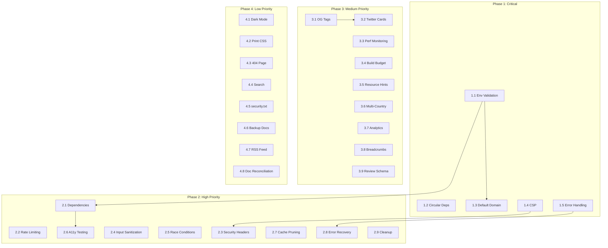

# Enterprise PSEO - Development Roadmap

**Created:** July 2025  
**Version:** 1.0  
**Based On:** ANALYSIS_REPORT.md (July 2025)  

---

## Overview

This roadmap organizes all identified issues and missing features from the comprehensive analysis report into prioritized phases. Each phase contains discrete, actionable tasks with complexity estimates and dependency mappings.

**Total Estimated Effort:** 29-43 developer-days for full remediation

---

## Priority Definitions

| Priority | Definition | Timeline | Impact |
|----------|------------|----------|--------|
| **Critical** | Security vulnerabilities, data loss risks, build-breaking bugs | Immediate (Sprint 1) | Blocks release, security risk |
| **High** | Major functionality gaps, performance issues, significant tech debt | Sprint 2-3 | Impacts quality, user experience |
| **Medium** | Important features, optimizations, documentation improvements | Sprint 4-6 | Enhances product, not blocking |
| **Low** | Nice-to-have features, polish, future considerations | Backlog | Incremental improvement |

---

## Phase 1: Critical Security & Stability (Sprint 1)

**Duration:** 2-3 days  
**Goal:** Eliminate critical security vulnerabilities and build-breaking issues

### Task 1.1: Environment Variable Validation
- **Priority:** Critical
- **Complexity:** Low (2 hours)
- **Dependencies:** None
- **Files Affected:** `config/app.config.js`, all adapters
- **Description:** 
  - Create `.env.example` template with all required variables
  - Add startup validation for API keys
  - Fail fast with clear error messages if required env vars missing
- **Acceptance Criteria:**
  - Application refuses to start without required env vars
  - Clear error messages indicate which variables are missing
  - `.env.example` committed to repository

### Task 1.2: Remove Circular Dependency
- **Priority:** Critical
- **Complexity:** Medium (4 hours)
- **Dependencies:** None
- **Files Affected:** `src/adapters/ai/openai-adapter.js`, `gemini-adapter.js`
- **Description:**
  - Extract mock response generation to shared utility
  - Remove direct import between adapters
  - Implement proper abstraction layer
- **Acceptance Criteria:**
  - No circular imports detected
  - All tests pass
  - Mock logic centralized in single location

### Task 1.3: Fix Hardcoded Default Domain
- **Priority:** Critical
- **Complexity:** Low (1 hour)
- **Dependencies:** Task 1.1
- **Files Affected:** `src/engines/generator-engine.js`, `config/seo.config.js`
- **Description:**
  - Remove hardcoded dev preview URL
  - Require explicit configuration or fail
  - Add validation to prevent accidental deployment with wrong domain
- **Acceptance Criteria:**
  - No hardcoded domains in source code
  - Build fails if canonical domain not configured
  - Documentation updated with configuration requirements

### Task 1.4: Implement Content Security Policy
- **Priority:** Critical
- **Complexity:** Medium (4 hours)
- **Dependencies:** None
- **Files Affected:** `src/_layouts/main.njk`, `eleventy.config.js`
- **Description:**
  - Add CSP meta tag to layout template
  - Configure appropriate directives for fonts, scripts, styles
  - Add SRI hashes for external resources
- **Acceptance Criteria:**
  - CSP header/meta present on all pages
  - No console errors from CSP violations
  - External fonts load with SRI hashes

### Task 1.5: Silent Error Handling Fix
- **Priority:** Critical
- **Complexity:** Medium (3 hours)
- **Dependencies:** None
- **Files Affected:** `src/engines/build-orchestrator.js`
- **Description:**
  - Replace silent catch blocks with proper logging
  - Implement error aggregation for build failures
  - Add error reporting to dashboard
- **Acceptance Criteria:**
  - All errors logged appropriately
  - Build fails visibly on critical errors
  - Error details available in dashboard reports

---

## Phase 2: High Priority Security & Quality (Sprint 2-3)

**Duration:** 5-7 days  
**Goal:** Address high-priority security gaps and quality issues

### Task 2.1: Install Missing Dependencies
- **Priority:** High
- **Complexity:** Low (1 hour)
- **Dependencies:** None
- **Files Affected:** `package.json`
- **Description:**
  - Add ESLint and Prettier to devDependencies
  - Add dotenv for environment variable handling
  - Add chalk for console coloring (if used)
  - Configure base rulesets
- **Acceptance Criteria:**
  - `npm install` succeeds
  - `npm run lint` executes without errors
  - `npm run format` formats code correctly

### Task 2.2: Implement Rate Limiting Enforcement
- **Priority:** High
- **Complexity:** Medium (4 hours)
- **Dependencies:** None
- **Files Affected:** `src/adapters/ai/queue-manager.js`, all AI adapters
- **Description:**
  - Enforce rate limits at adapter level
  - Add exponential backoff for 429 responses
  - Track API usage per provider
  - Add configurable rate limit settings
- **Acceptance Criteria:**
  - API calls respect provider rate limits
  - Automatic retry with backoff on 429
  - Usage metrics logged

### Task 2.3: Add Security Headers
- **Priority:** High
- **Complexity:** Low (2 hours)
- **Dependencies:** Task 1.4
- **Files Affected:** `src/_layouts/main.njk`, Cloudflare adapter
- **Description:**
  - Add X-Frame-Options, X-Content-Type-Options, etc.
  - Configure via Cloudflare adapter or static headers
  - Document header configuration
- **Acceptance Criteria:**
  - All recommended security headers present
  - No mixed content warnings
  - Headers verified via security scanner

### Task 2.4: Input Sanitization for AI Output
- **Priority:** High
- **Complexity:** Medium (4 hours)
- **Dependencies:** None
- **Files Affected:** `src/engines/writer-engine.js`, templates
- **Description:**
  - Implement sanitization library integration
  - Sanitize AI-generated content before rendering
  - Remove potentially dangerous HTML/entities
- **Acceptance Criteria:**
  - No XSS vulnerabilities in generated content
  - Sanitization configurable per field
  - Tests verify sanitization effectiveness

### Task 2.5: Race Condition Fix in Parallel Builds
- **Priority:** High
- **Complexity:** High (6 hours)
- **Dependencies:** None
- **Files Affected:** `src/engines/build-orchestrator.js`
- **Description:**
  - Implement proper locking for shared state
  - Use atomic operations for index updates
  - Add concurrency tests
- **Acceptance Criteria:**
  - No race conditions under load
  - Concurrent tests pass consistently
  - Performance unchanged or improved

### Task 2.6: Accessibility Testing Integration
- **Priority:** High
- **Complexity:** Medium (4 hours)
- **Dependencies:** Task 2.1
- **Files Affected:** `tests/`, `package.json`, `eleventy.config.js`
- **Description:**
  - Add axe-core or similar a11y testing tool
  - Integrate into test suite
  - Add a11y checks to build pipeline
- **Acceptance Criteria:**
  - Automated a11y tests run on every build
  - WCAG 2.1 AA compliance verified
  - Violations reported in test output

### Task 2.7: Cache Pruning Implementation
- **Priority:** High
- **Complexity:** Medium (4 hours)
- **Dependencies:** None
- **Files Affected:** `src/engines/build-cache.js`, `build-orchestrator.js`
- **Description:**
  - Detect orphaned pages when data changes
  - Remove stale files from src/pages/
  - Add cache cleanup command
- **Acceptance Criteria:**
  - Orphaned pages automatically removed
  - Cache size remains bounded
  - Manual cleanup command available

### Task 2.8: Error Recovery Automation
- **Priority:** High
- **Complexity:** Medium (4 hours)
- **Dependencies:** Task 1.5
- **Files Affected:** `src/engines/build-orchestrator.js`
- **Description:**
  - Implement automatic retry for transient failures
  - Add circuit breaker pattern
  - Resume from last successful checkpoint
- **Acceptance Criteria:**
  - Transient errors automatically retried
  - Build resumes after interruption
  - Failed jobs tracked and reported

### Task 2.9: Legacy Folder Cleanup
- **Priority:** High
- **Complexity:** Low (2 hours)
- **Dependencies:** None
- **Files Affected:** `/workspace/Test/`, `/workspace/pest-control-seo/`, `/workspace/engine/`
- **Description:**
  - Archive or remove legacy folders
  - Update documentation references
  - Verify no active code depends on removed folders
- **Acceptance Criteria:**
  - Repository structure cleaned
  - No broken imports
  - All tests pass

---

## Phase 3: Medium Priority Features (Sprint 4-6)

**Duration:** 3-5 days  
**Goal:** Implement important missing features and optimizations

### Task 3.1: Open Graph Tags Implementation
- **Priority:** Medium
- **Complexity:** Low (2 hours)
- **Dependencies:** None
- **Files Affected:** `src/_layouts/main.njk`, `src/engines/generator-engine.js`
- **Description:**
  - Add og:title, og:description, og:image, og:url
  - Generate social card images
  - Test with Facebook/Twitter debuggers
- **Acceptance Criteria:**
  - All OG tags present on generated pages
  - Social previews render correctly
  - Images meet platform requirements

### Task 3.2: Twitter Cards Implementation
- **Priority:** Medium
- **Complexity:** Low (2 hours)
- **Dependencies:** Task 3.1
- **Files Affected:** `src/_layouts/main.njk`
- **Description:**
  - Add Twitter Card meta tags
  - Configure card type (summary_large_image)
  - Validate with Twitter Card validator
- **Acceptance Criteria:**
  - Twitter Cards validate successfully
  - Previews display correctly

### Task 3.3: Performance Monitoring Setup
- **Priority:** Medium
- **Complexity:** Medium (4 hours)
- **Dependencies:** None
- **Files Affected:** `scripts/`, `package.json`
- **Description:**
  - Integrate Lighthouse CI or similar
  - Add Core Web Vitals tracking
  - Set performance budgets
- **Acceptance Criteria:**
  - Lighthouse scores tracked per build
  - Performance regressions detected
  - Budgets enforced in CI

### Task 3.4: Build Time Budget Enforcement
- **Priority:** Medium
- **Complexity:** Low (2 hours)
- **Dependencies:** None
- **Files Affected:** `src/engines/build-orchestrator.js`, CI config
- **Description:**
  - Set maximum build time threshold
  - Fail builds exceeding budget
  - Add build time reporting
- **Acceptance Criteria:**
  - Builds fail if exceeding time budget
  - Build times logged and trended
  - Alerts configured for slow builds

### Task 3.5: Resource Hints Implementation
- **Priority:** Medium
- **Complexity:** Low (2 hours)
- **Dependencies:** None
- **Files Affected:** `src/_layouts/main.njk`
- **Description:**
  - Add preload hints for critical fonts
  - Add preconnect for external APIs
  - Add dns-prefetch for analytics
- **Acceptance Criteria:**
  - Resource hints present in HTML head
  - LCP improved measurably
  - No unused preload warnings

### Task 3.6: Multi-Country Data Structure
- **Priority:** Medium
- **Complexity:** High (8 hours)
- **Dependencies:** None
- **Files Affected:** `data/`, `src/engines/dataset-engine.js`, `knowledge-engine.js`
- **Description:**
  - Refactor data structure to support multiple countries
  - Update loaders to handle country codes
  - Maintain backward compatibility with USA data
- **Acceptance Criteria:**
  - Data structure supports `locations/{country}/`
  - USA data continues to work
  - Plugin system can add new countries

### Task 3.7: Analytics Integration Framework
- **Priority:** Medium
- **Complexity:** Medium (4 hours)
- **Dependencies:** None
- **Files Affected:** `src/_layouts/main.njk`, `config/`
- **Description:**
  - Add Google Analytics snippet support
  - Make analytics configurable
  - Add privacy-compliant options
- **Acceptance Criteria:**
  - Analytics configurable via config
  - GDPR-compliant mode available
  - No analytics without explicit config

### Task 3.8: Breadcrumb Navigation
- **Priority:** Medium
- **Complexity:** Medium (4 hours)
- **Dependencies:** None
- **Files Affected:** `src/_includes/`, `src/engines/internal-link-engine.js`
- **Description:**
  - Implement breadcrumb component
  - Add breadcrumb schema.org markup
  - Style breadcrumbs consistently
- **Acceptance Criteria:**
  - Breadcrumbs visible on all location pages
  - Schema.org BreadcrumbList valid
  - Mobile-responsive design

### Task 3.9: Review/Rating Schema
- **Priority:** Medium
- **Complexity:** Low (2 hours)
- **Dependencies:** None
- **Files Affected:** `src/engines/schema-engine.js`
- **Description:**
  - Add AggregateRating schema
  - Add Review schema support
  - Integrate with existing LocalBusiness schema
- **Acceptance Criteria:**
  - Rich snippets validate in Google tester
  - Ratings display in search results (when applicable)

---

## Phase 4: Low Priority & Polish (Backlog)

**Duration:** 2-3 days  
**Goal:** Implement nice-to-have features and polish

### Task 4.1: Dark Mode Support
- **Priority:** Low
- **Complexity:** Medium (4 hours)
- **Dependencies:** None
- **Files Affected:** `src/_layouts/main.njk`, CSS
- **Description:**
  - Implement dark mode toggle
  - Add prefers-color-scheme support
  - Test all components in dark mode
- **Acceptance Criteria:**
  - Dark mode toggle functional
  - System preference respected
  - All pages readable in dark mode

### Task 4.2: Print Stylesheets
- **Priority:** Low
- **Complexity:** Low (2 hours)
- **Dependencies:** None
- **Files Affected:** CSS, `src/_layouts/main.njk`
- **Description:**
  - Add print media query styles
  - Optimize for paper printing
  - Hide non-essential elements
- **Acceptance Criteria:**
  - Pages print cleanly
  - No wasted ink/backgrounds
  - Contact info preserved

### Task 4.3: 404 Page
- **Priority:** Low
- **Complexity:** Low (2 hours)
- **Dependencies:** None
- **Files Affected:** `src/pages/404.njk`
- **Description:**
  - Create custom 404 page
  - Add helpful navigation
  - Match site branding
- **Acceptance Criteria:**
  - 404 page served for missing URLs
  - Helpful links provided
  - Consistent with site design

### Task 4.4: Search Functionality
- **Priority:** Low
- **Complexity:** High (8 hours)
- **Dependencies:** None
- **Files Affected:** New engine, templates
- **Description:**
  - Implement client-side search
  - Index all location pages
  - Add search UI component
- **Acceptance Criteria:**
  - Search finds all location pages
  - Fast response time (<100ms)
  - Mobile-friendly UI

### Task 4.5: security.txt
- **Priority:** Low
- **Complexity:** Low (1 hour)
- **Dependencies:** None
- **Files Affected:** `.well-known/security.txt`
- **Description:**
  - Create security.txt file
  - Add contact information
  - Link to vulnerability disclosure policy
- **Acceptance Criteria:**
  - security.txt accessible at /.well-known/security.txt
  - Valid format per RFC 9116
  - Contact information current

### Task 4.6: Backup Strategy Documentation
- **Priority:** Low
- **Complexity:** Low (2 hours)
- **Dependencies:** None
- **Files Affected:** `docs/12_OPERATIONS_RUNBOOK.md`
- **Description:**
  - Document backup procedures
  - Define RPO/RTO targets
  - Add recovery testing schedule
- **Acceptance Criteria:**
  - Backup procedures documented
  - Recovery steps tested
  - Schedule defined

### Task 4.7: RSS/Feed Generation
- **Priority:** Low
- **Complexity:** Medium (4 hours)
- **Dependencies:** None
- **Files Affected:** New engine, templates
- **Description:**
  - Generate RSS feed for new pages
  - Add Atom feed support
  - Include in sitemap
- **Acceptance Criteria:**
  - RSS feed validates
  - All pages included
  - Auto-discovery in HTML head

### Task 4.8: Documentation Reconciliation
- **Priority:** Low
- **Complexity:** High (8 hours)
- **Dependencies:** None
- **Files Affected:** All docs/ files
- **Description:**
  - Update outdated "Production Ready" claims
  - Reconcile documentation drift
  - Add missing diagrams
  - Fix cross-references
- **Acceptance Criteria:**
  - All documentation accurate
  - No conflicting information
  - Diagrams added where needed

---

## Dependency Graph

---

## Risk Assessment

| Risk | Probability | Impact | Mitigation |
|------|-------------|--------|------------|
| Breaking changes during refactoring | Medium | High | Comprehensive test suite, gradual rollout |
| Performance regression | Low | Medium | Performance budgets, monitoring |
| Documentation drift continues | High | Medium | Assign ownership, regular audits |
| API provider changes | Medium | High | Adapter pattern, abstraction layer |
| Scope creep | High | Medium | Strict prioritization, phased approach |

---

## Success Metrics

| Metric | Current | Target (Phase 1) | Target (Phase 2) | Target (Phase 3) |
|--------|---------|------------------|------------------|------------------|
| Security Score | 3/10 | 6/10 | 8/10 | 9/10 |
| Performance Score | 5/10 | 5/10 | 7/10 | 9/10 |
| SEO Score | 6/10 | 6/10 | 7/10 | 9/10 |
| Code Quality | 5/10 | 6/10 | 8/10 | 9/10 |
| Documentation Accuracy | 4/10 | 4/10 | 6/10 | 9/10 |
| Test Coverage | Unknown | 60% | 80% | 90% |

---

## Approval & Sign-off

| Role | Name | Date | Signature |
|------|------|------|-----------|
| Product Owner | | | |
| Technical Lead | | | |
| Security Lead | | | |
| QA Lead | | | |

---

*This roadmap is a living document and should be updated as priorities change or new information becomes available.*
